# Motus Telemetry Activity Pipeline

A reproducible workflow for estimating movement-based activity from automated radiotelemetry detections.

This pipeline converts Motus Wildlife Tracking System detections into detection-level active/inactive classifications and hourly activity summaries. It was developed and validated using Wood Thrush (*Hylocichla mustelina*) telemetry data, but the overall structure can be adapted to other species, receiver arrays, and tag deployments when the biological assumptions and required signal data are appropriate.

The framework uses proportional changes in received signal strength together with strongest-antenna switching and strongest-receiver switching, while accounting for transmitter burst interval, receiver-specific signal characteristics, signal quality, and isolated telemetry dropouts.

An optional stationary-tag screen can also identify deployments that show unusually prolonged inactivity near the end of the detection record.

This repository accompanies the manuscript:

> **A Standardized Framework for Estimating Animal Activity from Automated Radiotelemetry**

A full publication citation and DOI will be added here when available. Citation metadata for the software repository are also provided in `CITATION.cff`.

> **Recommended first step:** Run the full workflow using the included example dataset before applying it to a new Motus project.

---

## Contents

- [Quick start](#quick-start)
- [Requirements](#requirements)
- [Conceptual workflow](#conceptual-workflow)
- [What this pipeline is designed to do](#what-this-pipeline-is-designed-to-do)
- [Repository structure](#repository-structure)
- [Before running the pipeline](#before-running-the-pipeline)
- [Included example dataset](#included-example-dataset)
- [Required metadata](#required-metadata)
- [Key concepts](#key-concepts)
- [Why proportional signal change?](#why-proportional-signal-change)
- [Step 1 — Prepare Motus detections](#step-1--prepare-motus-detections)
- [Step 2 — Estimate activity thresholds](#step-2--estimate-activity-thresholds)
- [Step 3 — Classify activity](#step-3--classify-activity)
- [Optional stationary-tag screen](#optional-stationary-tag-screen)
- [Step 3 outputs](#step-3-outputs)
- [Step 3 processing log](#step-3-processing-log)
- [Diagnostic figures](#diagnostic-figures)
- [Diel timing](#diel-timing)
- [Quality-control checklist](#quality-control-checklist)
- [Common issues and solutions](#common-issues-and-solutions)
- [Things to consider when adapting the pipeline](#things-to-consider-when-adapting-the-pipeline)
- [Assumptions and limitations](#assumptions-and-limitations)
- [Adapting the pipeline to another study](#adapting-the-pipeline-to-another-study)
- [Minimal run example](#minimal-run-example)
- [Glossary](#glossary)
- [Data permissions and usage](#data-permissions-and-usage)
- [Tested environment](#tested-environment)
- [Getting help](#getting-help)
- [License](#license)
- [Citation](#citation)
- [Final notes](#final-notes)

---

## Quick start

Run the scripts in this order:

```text
Step1_Motus_to_Individual_Birds.R
                ↓
Step2_Activity_Threshold_Calculation.R
                ↓
Step3_Activity_Classification.R
                ↓
Step3_LOOP_Activity_Classification.R
       optional after testing one dataset
```

Recommended workflow:

1. Open the included RStudio project.
2. Restore the package environment with `renv`.
3. Run Step 1 using `run_mode <- "example"`.
4. Run Step 2 to estimate inactivity thresholds.
5. Run the single-dataset Step 3 and inspect its outputs and diagnostic plots.
6. Once the output looks appropriate, run the looped Step 3 to process all tag datasets.
7. Review the Step 3 processing log for skipped or failed datasets.

Each script has a clearly marked **USER SETTINGS** section near the beginning. New users should generally not need to edit anything below that section.

---

## Requirements

Recommended setup:

| Requirement | Notes |
|---|---|
| R | Developed and tested with R 4.5.1 |
| RStudio | Recommended, but not strictly required |
| `renv` | Used to restore the recorded package environment |
| Internet access | Required for package installation and direct Motus downloads |
| Motus credentials | Required only when using `run_mode <- "motus_download"` |
| Disk space | Depends strongly on project size and number of detections |

The included example dataset should generally take **approximately 5–10 minutes** to run through the full workflow on a typical desktop computer. Runtime can change substantially for full Motus projects depending on the number of detections, deployments, receivers, and available computing resources.

---

## Conceptual workflow

```text
Raw Motus detections
        │
        ▼
STEP 1
Load or download Motus detections
Apply motusFilter
Split detections by MotusTagID × mfgID
        │
        ▼
Individual tag datasets
        │
        ▼
STEP 2
Assign receiver hardware eras
Group detections from the same transmission
Identify presumed inactive periods
Calculate proportional signal change
Estimate tag-specific thresholds
        │
        ▼
Tag × receiver-era thresholds
        │
        ▼
Pool thresholds hierarchically by receiver type
        │
        ▼
STEP 3
Resolve biological deployments
Restrict detections to the focal receiver site
Attach receiver-type thresholds
Classify activity
Correct isolated telemetry dropouts
Optionally screen for prolonged inactivity
        │
        ▼
Detection-level activity classifications
        │
        ▼
Hourly activity summaries
Diagnostic plots
```

In plain language, the pipeline first prepares tag-specific Motus detections, then estimates how much signal variation is expected when an animal is relatively inactive, and finally uses that baseline to classify movement-based activity throughout the detection record.

---

## What this pipeline is designed to do

This workflow estimates **movement-based activity** from automated radiotelemetry detections. It does not directly observe or identify specific behaviors.

The pipeline was designed to address several common issues in automated radiotelemetry data:

- received signal strength varies because of both animal movement and non-biological factors
- tags can be redeployed on multiple animals
- receiver hardware can differ in signal scale and variability
- multiple antennas or receivers can detect the same transmission
- missed or poor-quality detections can create apparent activity
- isolated antenna or receiver switches can be telemetry artifacts
- extended stationary patterns near the end of a deployment may require manual review

The resulting activity estimates should therefore be interpreted as a **relative index of movement-based activity**, not as direct behavioral observations.

---

## Repository structure

A fresh copy of the repository should look approximately like:

```text
Telemetry_Activity_Pipeline/
│
├── Step1_Motus_to_Individual_Birds.R
├── Step2_Activity_Threshold_Calculation.R
├── Step3_Activity_Classification.R
├── Step3_LOOP_Activity_Classification.R
│
├── Helper_Functions/
│   ├── Activity_Timing_Functions.R
│   ├── Diagnostic_Plots_Functions.R
│   └── Step3_Activity_Functions.R
│
├── Sample_Data/
│   ├── Raw/
│   │   ├── Raw_Tower/
│   │   │   └── Example_Allerton_WOTH_052525_060225.RDS
│   │   │
│   │   └── Metadata/
│   │       ├── Tower_Metadata.csv
│   │       └── WOTH_IL_Metadata.csv
│   │
│   └── Example_Figures/
│       ├── Daily_Daytime_Activity.png
│       ├── Daily_Detected_vs_Expected.png
│       ├── Daily_Detected_vs_Expected_TimeOfDay.png
│       ├── Duty_cycle.png
│       ├── Example_Averaged_Hourly_Activity.png
│       ├── Example_Dropout_Correction.png
│       ├── Example_Dropout_Plot.png
│       ├── Nighttime_Threshold_Histogram.png
│       ├── Proportional_Signal_Graphic.png
│       ├── Signal_Difference.png
│       └── Stationary_Tag_Screen.png
│
├── renv/
├── renv.lock
├── CITATION.cff
├── LICENSE
└── Telemetry_Activity_Pipeline.Rproj
```

Running the workflow creates additional `Sample_Data/Interim/` and `Sample_Data/Processed/` outputs automatically.

---

# Before running the pipeline

## Open the R project

Open:

```text
Telemetry_Activity_Pipeline.Rproj
```

rather than opening individual scripts from outside the project.

This allows `here::here()` to resolve repository-relative paths correctly.

---

## Restore the package environment

The repository uses `renv` to help reproduce the package environment used during development.

If `renv` is not installed:

```r
install.packages("renv")
```

Then, from the project root:

```r
renv::restore()
```

The scripts also attempt to activate the project `renv` environment automatically.

If a required package is still unavailable, the scripts will stop and identify the missing package rather than silently continuing with an incomplete environment.

---

## Included example dataset

The repository includes a small real-data example:

```text
Sample_Data/Raw/Raw_Tower/Example_Allerton_WOTH_052525_060225.RDS
```

The example contains **real Wood Thrush detections subsampled to approximately one week at an Illinois breeding site monitored by two Motus receivers**. It is intentionally small so users can test the workflow before processing a full project.

The example is intended to let new users test:

- file paths
- Motus filtering
- tag-level splitting
- threshold estimation
- activity classification
- hourly summaries
- stationary-tag screening
- diagnostic plot generation

before working with a full Motus project.

The example dataset is a flattened Motus-style detection table. Step 1 can also begin from a full Motus project download or from another existing alltags-style `.RDS` file.

The full example workflow should generally run in about **5–10 minutes**, although runtime will vary among computers.

---

# Required metadata

Two metadata files are used throughout the workflow:

```text
Sample_Data/Raw/Metadata/WOTH_IL_Metadata.csv
Sample_Data/Raw/Metadata/Tower_Metadata.csv
```

The included files provide examples of the expected structure.

## Deployment metadata

At minimum, the current workflow expects:

| Column | Purpose |
|---|---|
| `motusTagID` | Motus tag identifier |
| `mfgID` | Manufacturer tag identifier |
| `Band` | Identifies the biological individual/deployment |
| `Date_tagged` | Deployment start date |
| `Date_end` | Deployment end date |
| `Lat` | Used for local time and diel periods |
| `Lon` | Used for local time and diel periods |
| `Burst_Interval` | Programmed transmitter burst interval in seconds |

`Time_tagged` is optional but strongly recommended. If unavailable, Step 3 assumes the deployment began at `00:00:00` on `Date_tagged`.

A `MotusTagID × mfgID` identifies a **tag dataset**, not necessarily one biological individual. Tags can be redeployed. Step 3 therefore uses `Band`, `Date_tagged`, and `Date_end` to separate biological deployments.

### Why `Date_end` matters

`Date_end` prevents detections outside the intended biological deployment from being included. This is particularly important when:

- a tag is redeployed
- a study focuses on one stationary period
- the animal leaves the focal receiver array
- migration or dispersal detections should be excluded
- detections continue after possible tag loss or mortality

If `Date_end` is missing, the script can use the next deployment of the same tag to limit the current deployment. If there is no later deployment, detections may continue to the end of the available record.

### Why `Time_tagged` matters

`Time_tagged` helps exclude detections recorded before release or during handling on the deployment day.

This can be especially important when tags are activated before deployment.

---

## Receiver metadata

The minimum primary receiver fields are:

| Column | Purpose |
|---|---|
| `recvDeployName` | Must match receiver names in Motus data |
| `DongleType_1` | Primary dongle/hardware type |
| `System1` | Primary receiver system |

For receivers that changed hardware, also provide:

```text
System1End
DongleType_2
System2
```

If no second receiver system exists, these fields may be left blank. The pipeline standardizes optional all-`NA` columns to character values so they do not cause logical-versus-character errors.

### Receiver hardware changes

For example:

```text
DongleType_1 = SigmaEight
System1 = SigmaEight
System1End = 2024-06-07

DongleType_2 = FUNcube
System2 = SensorGnome
```

is interpreted as:

| Era | Date range | Receiver type |
|---|---|---|
| 1 | through 2024-06-07 | `SigmaEight_SigmaEight` |
| 2 | beginning 2024-06-08 | `FUNcube_SensorGnome` |

Receiver names in `Tower_Metadata.csv` must match `recvDeployName` in the Motus detection data.

---

# Key concepts

## MotusTagID and mfgID

`MotusTagID` is the Motus-assigned tag identifier.

`mfgID` is the transmitter manufacturer's identifier.

The pipeline uses them together to identify a tag dataset:

```text
MotusTagID × mfgID
```

A tag dataset can contain more than one biological deployment if the transmitter was redeployed.

---

## Band

`Band` is used to distinguish biological individuals/deployments within a tag dataset.

Step 3 output folders therefore include the band number.

---

## Receiver era

A receiver era is a period during which receiver hardware remained consistent.

If a receiver changed system or dongle type, detections before and after that change are treated as separate hardware eras.

---

## Receiver type

The pipeline combines dongle family and receiver system to define a receiver type, for example:

```text
FUNcube_SensorGnome
RTL_SensorGnome
SigmaEight_SigmaEight
```

Thresholds are ultimately pooled by receiver type.

---

## Burst interval

`Burst_Interval` is the programmed interval between transmitter bursts, in **seconds**.

For example:

```text
Burst_Interval = 15
```

means the transmitter is expected to emit a burst approximately every 15 seconds.

---

## Transmission-event tolerance

A single transmitted burst may be recorded by multiple antennas or nearby receivers at slightly different timestamps.

The pipeline uses:

```r
transmission_event_tolerance <- 0.3
```

seconds to identify detections likely belonging to the same transmission event.

This means `0.3` seconds = **300 milliseconds**.

This is distinct from the burst-interval timing tolerance used to determine whether two consecutive transmission events occurred approximately one programmed burst interval apart.

---

## Signal-to-noise ratio

Signal-to-noise ratio is calculated as:

```r
SNR = sig - noise
```

The code currently stores receiver-specific thresholds in the column `S2N_cutoff`.

Default study values are:

| Receiver/dongle family | Cutoff |
|---|---:|
| `FUNcube` | 6 |
| `RTL` | 10 |
| `SigmaEight` | 12 |

These values can be changed when adapting the framework to other receiver systems.

---

## Signal difference

For valid consecutive detections:

```r
sig_diff = current signal - previous signal
```

`sig_diff` is measured in dB.

---

## Proportional signal change

The framework converts dB differences to a linear power ratio:

```r
sig_ratio = 10^(sig_diff / 10)
```

A value of `1` indicates no change.

Values greater than `1` indicate an increase in received signal strength, whereas values below `1` indicate a decrease.

---

## Inactive baseline

Step 2 estimates expected signal variation during a period when the animal is assumed to be relatively inactive.

For breeding Wood Thrushes, this is nighttime:

```r
timing %in% c("night_1", "night_2")
```

The inactive period should be reconsidered for species with different diel activity patterns.

---

# Why proportional signal change?

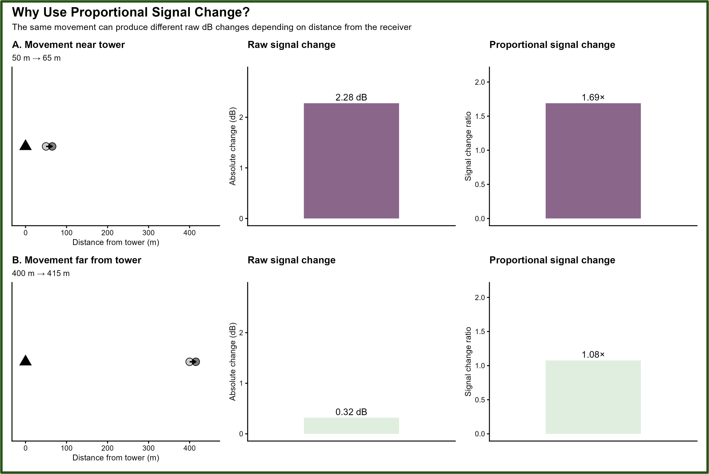

Received signal strength is recorded on a logarithmic dB scale. Consequently, a similar change in transmitter position can produce different absolute changes in received signal strength depending on transmitter-receiver distance and other propagation conditions.

The framework converts consecutive dB differences into proportional signal changes:

```r
sig_ratio = 10^(sig_diff / 10)
```

This does not eliminate all distance-related variation, but it reduces reliance on raw absolute dB changes and provides a more comparable measure of relative signal change across transmitter-receiver distances.

---

# Step 1 — Prepare Motus detections

## Script

```text
Step1_Motus_to_Individual_Birds.R
```

## Purpose

Step 1 loads Motus detections, applies the standard Motus filter, standardizes timestamps, and creates one dataset for each `MotusTagID × mfgID`.

## Input modes

### Example

```r
run_mode <- "example"
```

Loads the included example dataset.

### Existing alltags-style RDS

```r
run_mode <- "existing_rds"
```

Loads an existing flattened Motus-style `.RDS` file.

### Motus download

```r
run_mode <- "motus_download"
```

Downloads or updates a Motus project database and extracts the `alltags` table.

When `motus_download` is used, Motus login may be requested in the R console before the download begins.

In a new project, replace the project placeholder in the USER SETTINGS with the appropriate Motus project ID:

```r
projRecv_id <- YOUR_PROJECT_ID
```

## Timestamp handling

The original Motus `ts` field is used as the authoritative detection timestamp.

`ts` represents seconds since the Unix epoch in UTC and is converted using:

```r
lubridate::as_datetime(ts, tz = "UTC")
```

The pipeline does **not** require an existing `time` column.

Local time is assigned later from deployment coordinates.

## Step 1 output naming

Folders follow:

```text
<MotusTagID>_<mfgID>_<dataset_label>_<MMDDYY>_MotusFiltered
```

For example:

```text
84746_160_ExampleAllerton_081126_MotusFiltered
```

The six-digit field records the date on which Step 1 was run and can therefore differ among users and downloads.

Each folder contains:

```text
*.RDS
*.csv
```

The RDS file is used downstream. The CSV is provided for easier inspection outside R.

---

# Step 2 — Estimate activity thresholds

## Script

```text
Step2_Activity_Threshold_Calculation.R
```

## Purpose

Step 2 estimates the amount of signal variation expected during a biologically defined period of relative inactivity.

For the Wood Thrush example, nighttime detections are used because breeding Wood Thrushes are primarily diurnal.

Users applying the framework to another species should choose an appropriate calibration period.

## What Step 2 does

Step 2:

1. reads the Step 1 tag datasets
2. loads deployment and receiver metadata
3. assigns receiver hardware eras
4. identifies the receiver with the strongest/most consistent detection record for threshold estimation
5. groups detections representing the same transmission event
6. assigns local diel timing
7. calculates valid signal differences and proportional signal ratios
8. identifies qualifying inactive-period sequences
9. estimates tag-specific thresholds
10. saves threshold summaries and diagnostic plots

## Transmission events versus burst intervals

A single transmitter burst may be detected by multiple antennas or receivers at slightly different timestamps.

Before calculating signal change, detections that fall within the transmission-event tolerance are treated as one burst and the strongest signal is retained.

For example:

```text
0.00 s
0.18 s
0.27 s
```

may represent three receiver records of one transmitted burst.

After duplicates are collapsed, consecutive transmission events are evaluated against the programmed transmitter burst interval.

For a tag with:

```text
Burst_Interval = 15.0 s
tolerance      = 0.3 s
```

a valid consecutive pair must occur approximately:

```text
14.7–15.3 s
```

apart.

These are separate concepts:

```text
≤ 0.3 s
same transmitted burst
        ↓
retain strongest record

approximately one programmed burst interval
        ↓
valid consecutive transmission pair
```

## Qualifying inactive sequences

The default Wood Thrush implementation requires:

```r
min_consecutive_night_detections <- 15
```

consecutive valid nighttime detections before estimating an individual threshold for a tag × receiver era.

This helps avoid estimating thresholds from isolated or fragmented records.

Tags that do not meet this criterion do not contribute an individual threshold, but Step 3 can still classify their activity if a pooled threshold is available for their receiver type.

## Threshold calculation

For valid consecutive transmission events:

```r
sig_diff = current signal - previous signal
sig_ratio = 10^(sig_diff / 10)
ln_sig_ratio = log(sig_ratio)
```

Thresholds are then calculated from the inactive baseline:

```r
median_ratio <- median(sig_ratio, na.rm = TRUE)
sigma_ln <- sd(ln_sig_ratio, na.rm = TRUE)

lower_ratio <-
  median_ratio *
  exp(-threshold_sd_multiplier * sigma_ln)

upper_ratio <-
  median_ratio *
  exp( threshold_sd_multiplier * sigma_ln)
```

The default is:

```r
threshold_sd_multiplier <- 2
```

Equivalent dB values are retained for plotting and interpretation.

## Hierarchical threshold pooling

Thresholds are pooled in two stages:

1. tag-specific threshold estimates are summarized within each receiver using the median
2. receiver-level medians are averaged across receivers sharing the same hardware type

The resulting receiver-type thresholds are used in Step 3.

## Step 2 outputs

Typical outputs include:

```text
all_birds_thresholds_summary_<dataset>.csv
all_birds_threshold_results_<dataset>.RDS
threshold_hist_plots/
```

The threshold summary contains one row per qualifying tag × receiver era.

---

## Threshold diagnostic figure

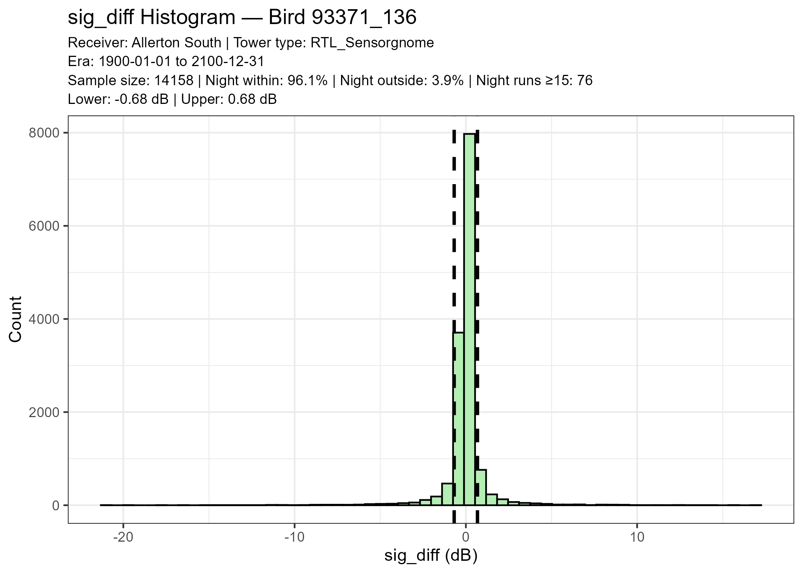

This figure shows the distribution of signal variation used to estimate the inactive baseline.

Look for:

- a distribution centered near little or no signal change
- sufficient sample size
- threshold bounds that contain most presumed inactive observations
- absence of extreme skew or unusually broad noise tails

A broad, sparse, or highly asymmetric distribution should be reviewed before relying on that threshold.

---

# Step 3 — Classify activity

Two Step 3 scripts are provided:

| Script | Use |
|---|---|
| `Step3_Activity_Classification.R` | Test or process one tag dataset |
| `Step3_LOOP_Activity_Classification.R` | Process all available tag datasets |

Both scripts call the same shared processing function in:

```text
Helper_Functions/Step3_Activity_Functions.R
```

This ensures that the single-dataset and batch workflows use the same activity-classification logic.

## Recommended use

Run the single-dataset version first.

Inspect the resulting tables and diagnostic plots.

Once the output looks appropriate, run the looped version for all tag datasets.

---

## Single-dataset settings

Specify:

```r
target_MotusTagID <- "84746"
target_mfgID <- "160"
target_dataset_label <- "ExampleAllerton"
```

The script automatically selects the newest matching Step 1 folder.

---

## Multi-receiver sites

Nearby receivers that form one biological monitoring site can be grouped in the USER SETTINGS.

Example:

```r
multi_receiver_sites <- tibble::tribble(
  ~site_id,   ~recvDeployName,
  "Allerton", "Allerton",
  "Allerton", "Allerton South"
)
```

If no receivers should be grouped:

```r
multi_receiver_sites <- tibble::tibble(
  site_id = character(),
  recvDeployName = character()
)
```

If the dominant receiver belongs to a defined site, detections from all receivers in that site are retained.

If it does not belong to a defined site, only the dominant receiver is retained.

Receiver switching within a retained site can still contribute evidence of movement.

---

## Activity classification

A valid interval can be classified as active when one or more of the following occur:

- proportional signal change falls outside the receiver-type inactivity bounds
- the strongest antenna changes
- the strongest receiver changes

Classification additionally requires valid burst timing and adequate signal quality.

The shared `classify_activity()` function also applies isolated telemetry-dropout correction.

---

## Telemetry dropout correction

A brief apparent antenna or receiver switch can occasionally occur even when the transmitter has not moved.

The framework identifies isolated switches when:

1. one detection briefly switches antenna or receiver
2. the detections immediately before and after return to the original antenna or receiver
3. surrounding proportional signal changes remain within inactivity thresholds

When all criteria are met, the isolated switch is treated as a telemetry artifact rather than biological movement.

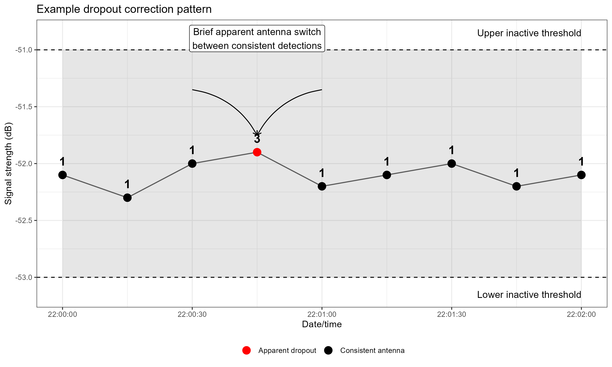

The conceptual figure illustrates how an isolated switch can occur while surrounding signal changes remain consistent with inactivity.

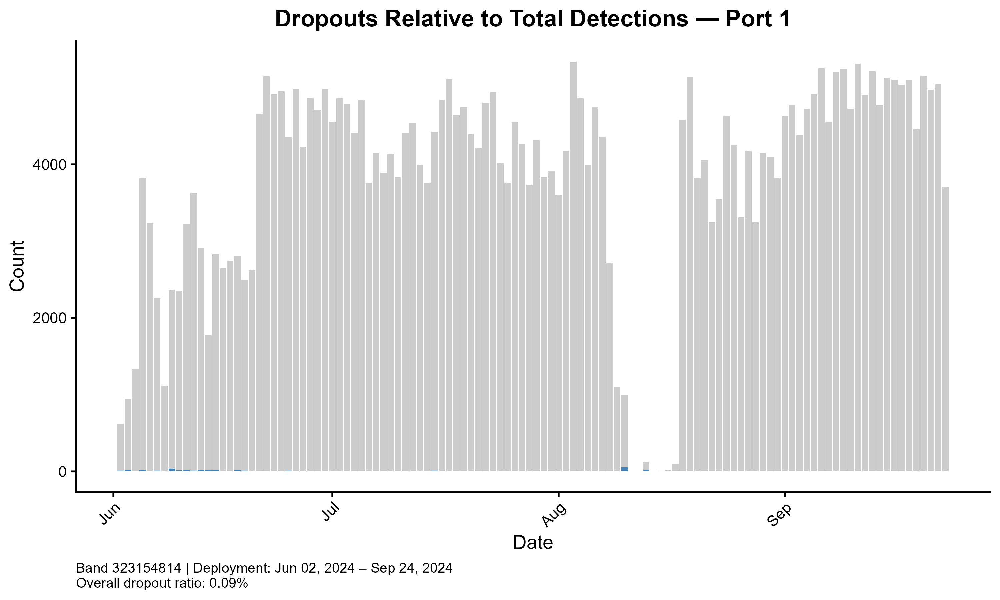

The observed dropout plot shows where isolated telemetry dropouts were detected within an example deployment.

---

# Optional stationary-tag screen

Step 3 includes an optional diagnostic screen for extended inactivity near the end of a deployment.

Enable it with:

```r
run_stationary_tag_screen <- TRUE
```

The diel period is user-selectable:

```r
stationary_screen_timing <- "day"
```

Available options are:

```text
"day"
"night"
"all"
```

Choose a period during which the focal species would normally be expected to show activity.

For a primarily diurnal species such as the Wood Thrush example, `"day"` avoids flagging normal nighttime roosting as suspicious inactivity.

Default settings are:

```r
stationary_late_window_hours <- 72
stationary_receiver_selection_hours <- 24
stationary_min_valid_late <- 30
stationary_min_prop_within <- 0.80
stationary_max_mean_abs_sigdif <- 2.5
stationary_min_receiver_prop <- 0.50
```

A deployment is flagged only when all criteria are met.

The screen is a **diagnostic flag only**. It does not modify activity classifications and should not be interpreted as confirmed mortality or tag loss.

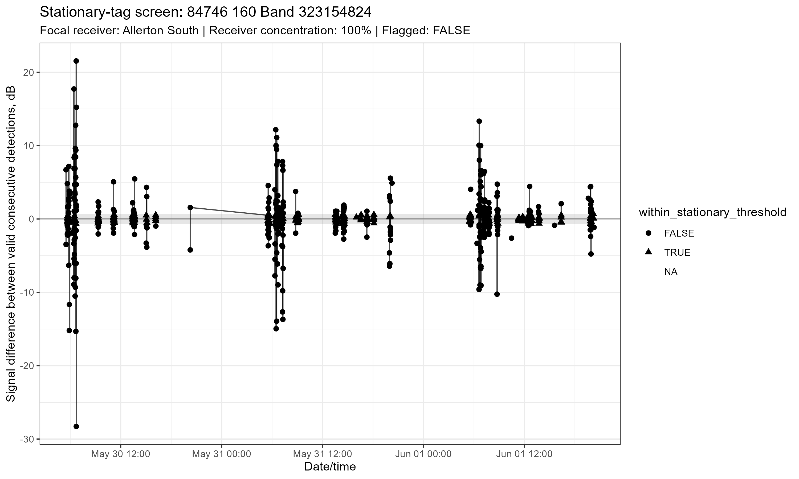

This plot shows signal differences during the selected final screening window. A deployment with many valid comparisons inside inactivity bounds, low average signal variation, and strong concentration on one receiver may warrant manual review.

---

# Step 3 outputs

Each biological deployment receives its own output folder:

```text
<MotusTagID>_<mfgID>_Band<Band>_<dataset_label>_classified
```

For example:

```text
84746_160_Band323154824_ExampleAllerton_classified
```

Typical contents are:

```text
84746_160_Band323154824_ExampleAllerton_classified/
│
├── *_ActivityWide.csv
├── *_ActivityPerHourPerDay.csv
├── *_ActivityPerHourSummary.csv
├── *_StationaryTagScreen.csv
├── *_StationaryTagScreen_LateData.csv
└── plots/
```

Stationary-tag files are only created when the screen can be evaluated.

---

## Detection-level activity table

`*_ActivityWide.csv` contains the detection-level activity classification.

Important fields include:

| Column | Meaning |
|---|---|
| `date_time_local` | Detection time in local time |
| `timing` | Diel period |
| `recvDeployName` | Receiver |
| `top_port` | Strongest antenna port |
| `sig_diff` | Valid signal-strength difference |
| `sig_ratio` | Proportional signal change |
| `within_threshold` | Whether the change remained within inactivity bounds |
| `active` | Final activity classification |
| `activity_denominator` | Whether the row contributes to activity summaries |
| `lower_ratio`, `upper_ratio` | Proportional inactivity thresholds |
| `lower_db`, `upper_db` | Equivalent dB thresholds |
| `tolerance` | Burst-interval timing tolerance |
| `S2N_cutoff` | Receiver-specific signal-quality cutoff |

---

## Hourly activity table

`*_ActivityPerHourPerDay.csv` summarizes activity for each local date × hour × diel period.

The default hourly coverage threshold is:

```r
sample_size_threshold <- 0.25
```

For a 15-second transmitter:

```text
3600 / 15 = 240 expected intervals per hour

240 × 0.25 = 60 required valid intervals
```

Hours with fewer than the required number of valid intervals are excluded.

---

## Hourly summary table

`*_ActivityPerHourSummary.csv` aggregates retained activity across days by hour and timing period.

---

# Step 3 processing log

The looped Step 3 creates:

```text
Step3_processing_log.csv
```

This is a **batch-processing quality-control record**, not a biological analysis output.

It records whether each tag dataset:

- completed successfully
- contained deployments that were skipped
- encountered a fatal processing error

The loop continues to later tag datasets if one dataset fails.

Review the processing log after every full batch run.

---

# Diagnostic figures

Diagnostic figures should be reviewed before activity estimates are used in biological analyses.

## Hourly activity

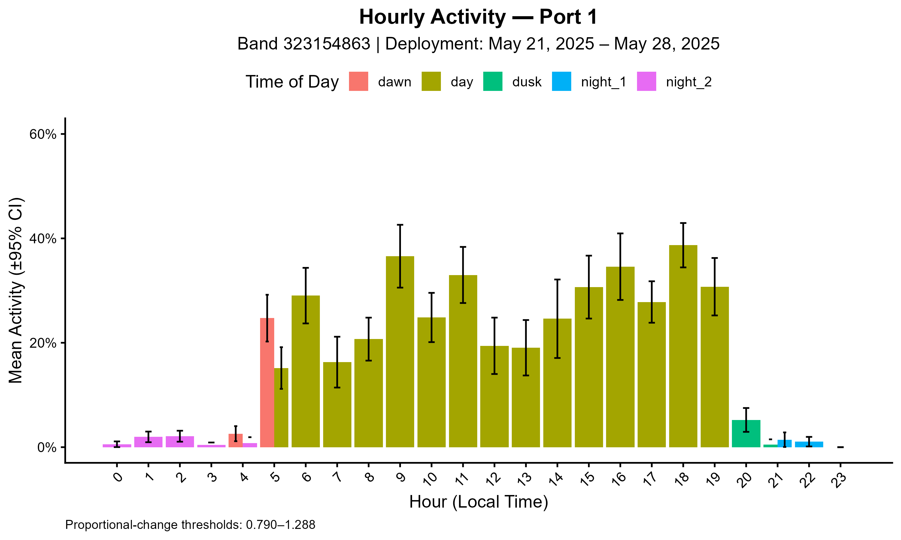

This plot shows the proportion of valid intervals classified as active within each hour.

For the Wood Thrush example, plausible output generally includes relatively low nighttime activity and greater daytime activity.

Patterns should always be interpreted in the context of species biology.

---

## Detected versus expected transmissions

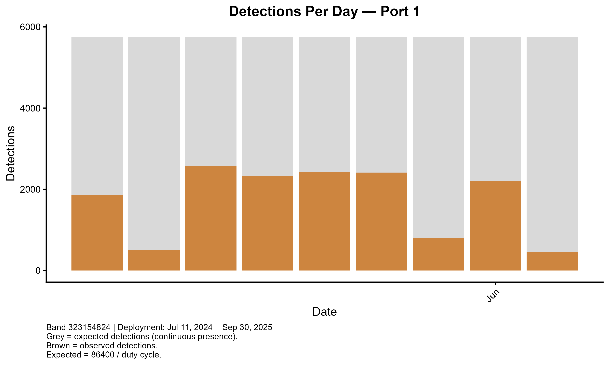

This diagnostic compares observed detections with the number expected from the programmed burst interval.

Low detection coverage can result from:

- distance from the receiver
- vegetation or terrain obstruction
- antenna orientation
- weak signal quality
- receiver downtime
- movement outside receiver coverage

Low detections do not necessarily indicate absence.

---

## Detection coverage by diel period

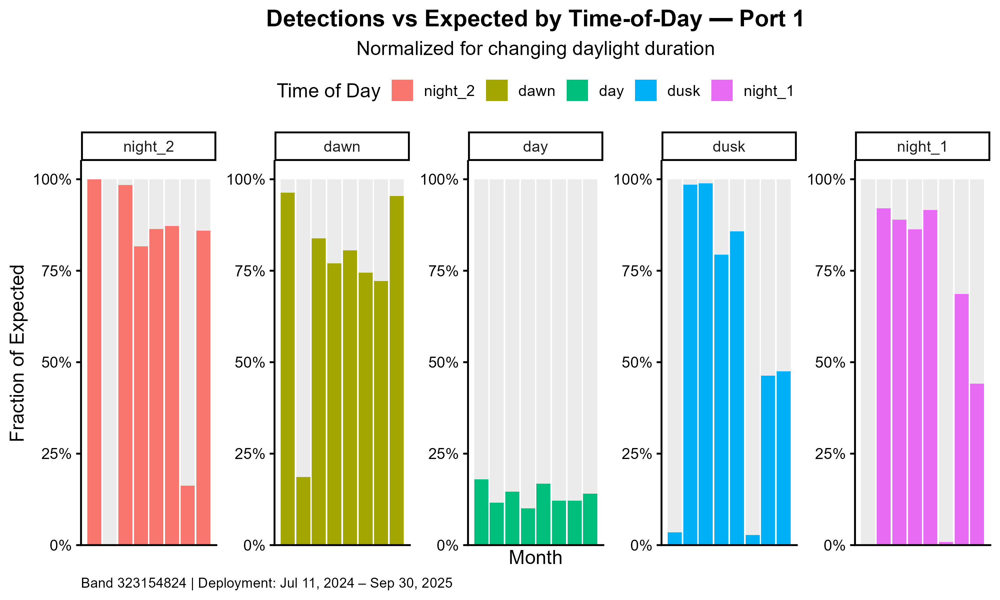

This plot expresses detection coverage relative to the amount of time available in each diel period.

It can help identify systematic differences in receiver coverage among day, dawn, dusk, and night.

---

## Burst-interval diagnostic

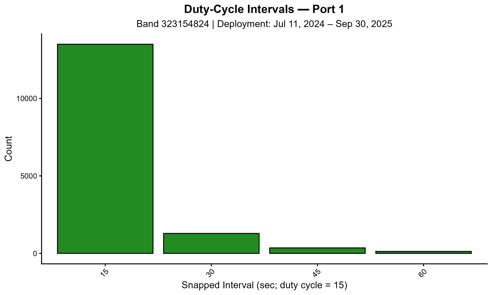

This plot shows elapsed time between detections.

A strong concentration near the programmed burst interval indicates consistent tag detection.

Broad or irregular distributions can indicate:

- missed transmissions
- weak signal
- receiver noise
- intermittent receiver coverage

---

## Signal-difference diagnostic

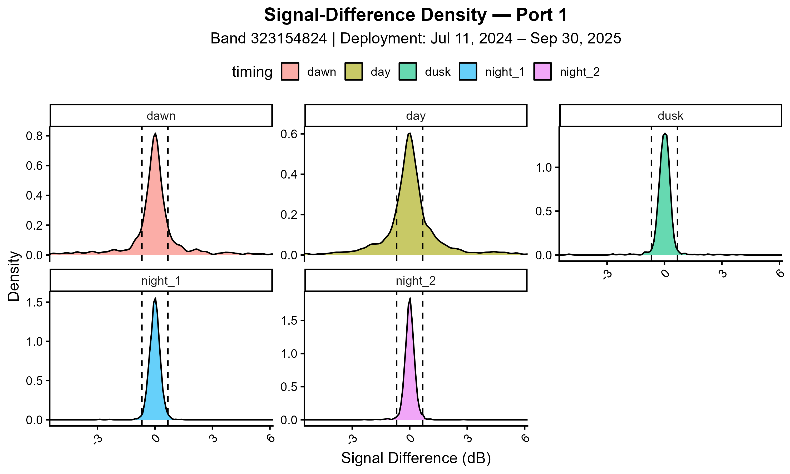

This plot shows valid signal differences and corresponding inactivity bounds.

Very broad or strongly asymmetric distributions may indicate receiver noise, weak signal quality, or a threshold that deserves closer inspection.

---

## Dropout diagnostic


This figure shows isolated antenna or receiver switches identified by the dropout correction.

Occasional events are expected. Consistently high dropout rates may warrant inspection of:

- receiver hardware
- signal quality
- electromagnetic noise
- power supply stability
- antenna configuration

---

## Daily daytime activity

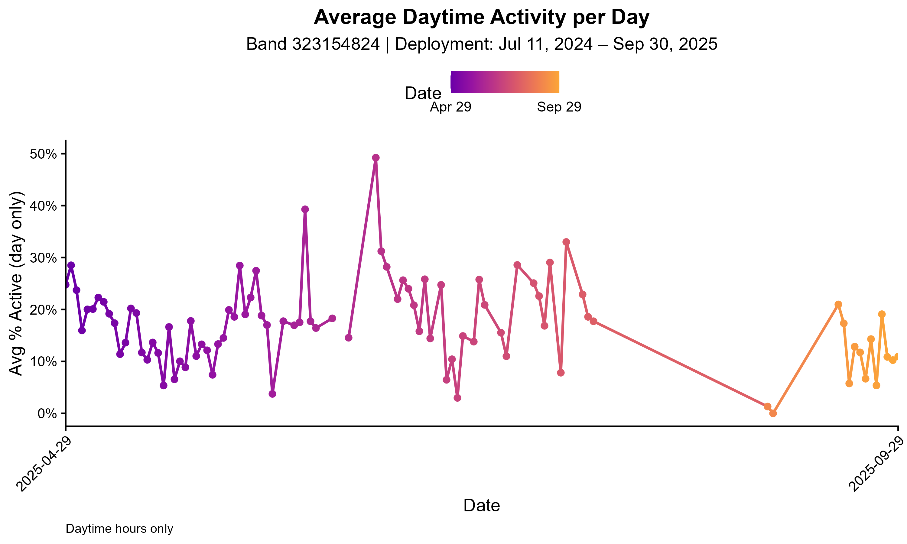

This plot summarizes daytime activity through time.

It can help identify:

- gradual behavioral changes
- abrupt activity declines
- extended stationary periods
- changes in receiver coverage

A decline in activity should be interpreted alongside detection effort and stationary-tag diagnostics.

---

## Stationary-tag screen


This plot shows the final selected screening window used by the stationary-tag diagnostic.

A high proportion of valid signal changes inside inactivity bounds, combined with low mean signal variation and concentration on one receiver, may indicate an unusually stationary tag.

This plot should always be reviewed manually rather than treated as a mortality classifier.

---

# Diel timing

Detections are assigned to diel periods from deployment coordinates and local solar times.

The current categories are:

```text
dawn     = nautical dawn → sunrise
day      = sunrise → sunset
dusk     = sunset → nautical dusk
night_1  = nautical dusk → midnight
night_2  = midnight → nautical dawn
```

`night_1` and `night_2` are kept separate internally so nighttime sequences remain chronologically ordered across midnight.

---

# Quality-control checklist

Before interpreting activity results, confirm the following.

## Metadata

- [ ] Every `motusTagID × mfgID` in Step 1 has matching deployment metadata.
- [ ] `Band` values correctly identify biological deployments.
- [ ] `Date_tagged` values are correct.
- [ ] `Date_end` values exclude detections outside the focal biological deployment.
- [ ] `Time_tagged` is included when available.
- [ ] `Burst_Interval` values are in seconds and reflect actual transmitter programming.
- [ ] Deployment coordinates are correct.
- [ ] Every retained receiver appears in `Tower_Metadata.csv`.
- [ ] Receiver hardware changes are represented correctly.

## Thresholds

- [ ] Thresholds are based on an appropriate inactive period.
- [ ] Qualifying threshold estimates contain a sufficiently long consecutive detection sequence.
- [ ] Threshold histograms have adequate sample size.
- [ ] Threshold distributions are not dominated by obvious noise or extreme skew.
- [ ] Receiver-type pooling matches the intended hardware categories.

## Activity classification

- [ ] Hourly detection coverage is adequate.
- [ ] Activity patterns are biologically plausible.
- [ ] Multi-receiver site definitions reflect the actual receiver array.
- [ ] Redeployed tags create separate biological deployment outputs.
- [ ] Dropout rates are not unexpectedly high.
- [ ] No unexplained receiver-threshold mismatches remain.

## Stationary-tag screening

- [ ] The selected `stationary_screen_timing` is biologically appropriate.
- [ ] Flagged deployments were manually reviewed.
- [ ] Detection timelines were considered.
- [ ] Receiver context and possible downtime were considered.
- [ ] Maps or receiver locations were reviewed when available.
- [ ] A stationary flag was not treated as confirmed mortality or tag loss by itself.

## Batch processing

- [ ] `Step3_processing_log.csv` was reviewed.
- [ ] Any failed datasets were investigated.
- [ ] Any skipped deployments were understood before downstream analysis.

---

# Common issues and solutions

## Step 1: Motus login prompt does not complete

When using:

```r
run_mode <- "motus_download"
```

Motus may request login credentials in the R console.

If authentication is interrupted:

1. restart the R session
2. reopen the project
3. rerun Step 1
4. enter credentials directly in the console when prompted

Also confirm that the download directory is writable.

---

## Step 1: existing RDS does not contain `ts`

The current workflow uses the original Motus `ts` field as the authoritative timestamp.

The pipeline no longer relies on an existing `time` column.

An existing alltags-style RDS should therefore retain:

```text
ts
```

If `ts` is absent, regenerate the alltags-style file from the original Motus data rather than creating an arbitrary replacement timestamp.

---

## Step 1: no detections remain after `motusFilter == 1`

Possible causes include:

- the input dataset contains no detections passing the standard Motus filter
- the wrong project or source file was loaded
- the file was already subset incorrectly before Step 1

Inspect the input dataset and the `motusFilter` field.

---

## Step 2: no threshold estimated for a tag

Possible causes include:

- too few inactive-period detections
- no run meeting `min_consecutive_night_detections`
- poor signal quality
- missing receiver metadata
- receiver dates not matching a defined hardware era
- invalid or missing `Burst_Interval`

A tag does not need its own threshold to be classified in Step 3 if an appropriate pooled receiver-type threshold exists.

---

## Step 2: threshold distribution looks unusually broad

Possible causes include:

- weak or noisy signals
- animal movement during the presumed inactive period
- receiver instability
- inappropriate SNR cutoff
- mixed receiver hardware eras
- sparse or fragmented detections

Inspect the threshold histogram and receiver metadata before proceeding.

---

## Step 3: no matching deployment metadata

Check that:

```text
motusTagID
mfgID
Band
```

match the Step 1 dataset and deployment metadata.

Also check for accidental conversion of IDs to scientific notation or loss of leading zeros in spreadsheet software.

---

## Step 3: missing receiver metadata or thresholds

Possible causes include:

- `recvDeployName` does not match `Tower_Metadata.csv`
- the receiver is missing from tower metadata
- the receiver hardware era does not cover the detection date
- Step 2 did not generate a threshold for that receiver type
- receiver-type names differ between Step 2 and Step 3

If the animal moved beyond the focal study array, distant receivers may also lack the metadata and thresholds required for classification.

Carefully defining `Date_end` can help prevent unrelated later detections from entering a stationary-period activity analysis.

---

## Step 3: all-NA `System2` or `DongleType_2` causes type errors

The current workflow standardizes these optional tower-metadata fields to character values before receiver eras are built.

If this error reappears, confirm that the current version of `Step3_Activity_Functions.R` is being sourced.

Restarting the R session before rerunning Step 3 can help ensure the newest function definitions are loaded.

---

## Step 3: single and loop outputs have different names

Both Step 3 scripts should call the same shared `process_tag_dataset()` function.

Expected output naming is:

```text
<MotusTagID>_<mfgID>_Band<Band>_<dataset_label>_classified
```

For example:

```text
84746_160_Band323154824_ExampleAllerton_classified
```

If the loop produces a different label, confirm that the latest `Step3_Activity_Functions.R` is being sourced and restart R before rerunning.

---

## Step 3: stationary-tag screen was skipped

The screen returns no result when too few qualifying detections are available.

Possible causes include:

- too few detections overall
- too few detections in the selected diel period
- too few valid late-window signal comparisons
- poor signal quality
- detections that do not occur approximately one burst interval apart

A skipped screen does **not** mean the deployment was confirmed to be active or non-stationary.

---

## Step 3 loop: one tag fails but the script continues

This is intentional.

The loop records the error in:

```text
Step3_processing_log.csv
```

and continues to the next tag dataset.

Review the processing log after the batch run.

---

# Things to consider when adapting the pipeline

## Choose an appropriate inactive baseline

Nighttime works for the breeding Wood Thrush example because the birds are primarily diurnal.

For a nocturnal species, nighttime may be inappropriate.

The inactive calibration period should represent a biologically justified period of relatively low movement.

---

## Reconsider receiver-specific SNR thresholds

The default values were selected for the receiver systems used in this study.

Researchers applying the framework elsewhere should inspect their own receiver signal distributions and may wish to test alternative SNR cutoffs.

---

## Reconsider transmission-event tolerance

The default:

```r
transmission_event_tolerance <- 0.3
```

seconds was chosen to group nearly simultaneous detections of the same burst.

Different receiver networks, timestamp precision, or data-processing systems may require a different value.

---

## Check transmitter burst intervals carefully

`Burst_Interval` must be in **seconds**.

Do not confuse:

```text
0.3 s transmission-event tolerance
```

with:

```text
approximately 15 s transmitter burst interval
```

These serve different purposes.

---

## Define multi-receiver sites biologically

Only receivers representing the same local monitoring array should be grouped.

Grouping distant receivers could cause unrelated detections to be treated as local movement.

---

## Use the stationary screen only as a diagnostic

The stationary-tag screen can indicate:

- possible tag loss
- possible mortality
- a stationary transmitter
- prolonged inactivity
- unusual receiver behavior

but does not distinguish among these outcomes.

---

## Inspect diagnostic plots

Automated classification should not replace data-quality review.

At minimum, examine:

- threshold histograms
- hourly activity patterns
- detection coverage
- burst-interval distributions
- signal-difference distributions
- dropout patterns
- stationary-tag diagnostics

before downstream biological interpretation.

---

# Assumptions and limitations

## Activity is inferred, not directly observed

The pipeline estimates movement-based activity from telemetry signal patterns.

It does not identify specific behaviors such as:

- foraging
- singing
- provisioning
- preening
- resting
- predator avoidance

Similar activity values may therefore represent different behaviors in different contexts.

---

## Proportional scaling reduces but does not eliminate signal bias

Received signal strength remains influenced by:

- transmitter-receiver distance
- vegetation
- terrain
- antenna orientation
- weather
- receiver processing
- electromagnetic noise
- local receiver geometry

The proportional framework reduces dependence on absolute dB changes but cannot remove all environmental or receiver-related variation.

---

## Receiver hardware matters

Different receiver systems can differ in signal scale, sensitivity, processing, and noise.

Thresholds should only be transferred among receiver systems for which comparable signal behavior and appropriate calibration have been established.

---

## Accurate deployment metadata are essential

Errors in:

```text
Band
Date_tagged
Time_tagged
Date_end
Burst_Interval
```

can assign detections to the wrong biological deployment or produce incorrect timing expectations.

---

## Highly mobile animals may produce sparse local records

Activity estimation depends on sufficient repeated detections.

Animals that quickly leave receiver coverage may not provide enough consecutive detections for threshold estimation or hourly activity summaries.

---

# Adapting the pipeline to another study

At minimum, review these settings before using the workflow on a different project:

1. Motus project ID or input RDS
2. input and output paths
3. dataset label
4. deployment metadata
5. receiver metadata
6. transmitter burst intervals
7. transmission-event tolerance
8. burst-interval timing tolerance
9. receiver-specific SNR cutoffs
10. inactive calibration period
11. multi-receiver site definitions
12. hourly coverage threshold
13. stationary-screen timing
14. stationary-screen thresholds
15. receiver types represented in the project

Do not assume that parameters validated for Wood Thrushes are automatically appropriate for another species or receiver system.

---

# Minimal run example

## Step 1

For the included example:

```r
run_mode <- "example"

source("Step1_Motus_to_Individual_Birds.R")
```

For a Motus project download:

```r
run_mode <- "motus_download"

projRecv_id <- YOUR_PROJECT_ID

source("Step1_Motus_to_Individual_Birds.R")
```

For an existing alltags-style RDS:

```r
run_mode <- "existing_rds"

existing_alltags_rds <- here::here(
  "path",
  "to",
  "your_alltags_file.RDS"
)

source("Step1_Motus_to_Individual_Birds.R")
```

---

## Step 2

Edit the USER SETTINGS section as needed, then run:

```r
source("Step2_Activity_Threshold_Calculation.R")
```

---

## Step 3A: one tag dataset

Edit:

```r
target_MotusTagID <- "84746"
target_mfgID <- "160"
target_dataset_label <- "ExampleAllerton"
```

then run:

```r
source("Step3_Activity_Classification.R")
```

---

## Step 3B: all tag datasets

After confirming that the single-dataset output looks appropriate:

```r
source("Step3_LOOP_Activity_Classification.R")
```

Then review:

```text
Step3_processing_log.csv
```

---

# Glossary

| Term | Meaning |
|---|---|
| Activity | Inferred movement-based activity from telemetry signal patterns |
| Band | Biological individual/deployment identifier |
| Burst interval | Programmed interval between transmitter bursts |
| Dataset label | User-defined label retained in Step 1 and Step 3 output names |
| Deployment | One biological use of a transmitter on an animal |
| Inactive baseline | Signal variation during a presumed low-movement period |
| MotusTagID | Motus-assigned tag identifier |
| mfgID | Manufacturer transmitter identifier |
| Receiver era | Period with consistent receiver hardware |
| Receiver type | Combined hardware category used for threshold pooling |
| SNR | Signal-to-noise ratio calculated as `sig - noise` |
| `sig_diff` | dB difference between valid consecutive transmissions |
| `sig_ratio` | Proportional signal change derived from `sig_diff` |
| Stationary-tag screen | Diagnostic screen for unusually prolonged inactivity |
| Transmission event | One underlying transmitter burst, possibly recorded multiple times |

---

# Data permissions and usage

The included example detections are **real Wood Thrush data subsampled to approximately one week at an Illinois breeding site with two receivers** and are provided for demonstrating and testing the workflow.

They should not be treated as an independent public ecological dataset beyond the purpose for which they are included in this repository unless the accompanying data-use terms explicitly allow that use.

Users applying the pipeline to Motus data are responsible for following applicable:

- Motus data-use agreements
- project permissions
- collaborator expectations
- permitting requirements

---

# Tested environment

The workflow was developed using:

| Component | Version |
|---|---|
| R | 4.5.1 |
| Operating system | Windows 11 |

Exact package versions are recorded in:

```text
renv.lock
```

Use:

```r
renv::restore()
```

for the most reproducible setup.

---

# Getting help

For reproducibility problems, software bugs, or suggested improvements, please open a GitHub issue when possible so that questions and solutions remain visible to other users.

For project-specific questions, contact:

**Lauren E. Brunk**  
**Michael P. Ward**

---

# License

This repository is released under the GNU General Public License v3.0 (GPL-3.0).

See:

```text
LICENSE
```

for the full license terms.

---

# Final notes

This pipeline is intended to be transparent, reproducible, and adaptable, but activity estimates should always be evaluated in the context of species biology, study design, receiver coverage, and signal quality.

The included example dataset provides a small real-data test case so users can verify that the workflow runs successfully before applying it to a full Motus project.

Because full-project runtime and storage requirements depend strongly on project size, users working with large Motus datasets should expect substantially longer processing times than the approximately 5–10 minutes required for the included example.
